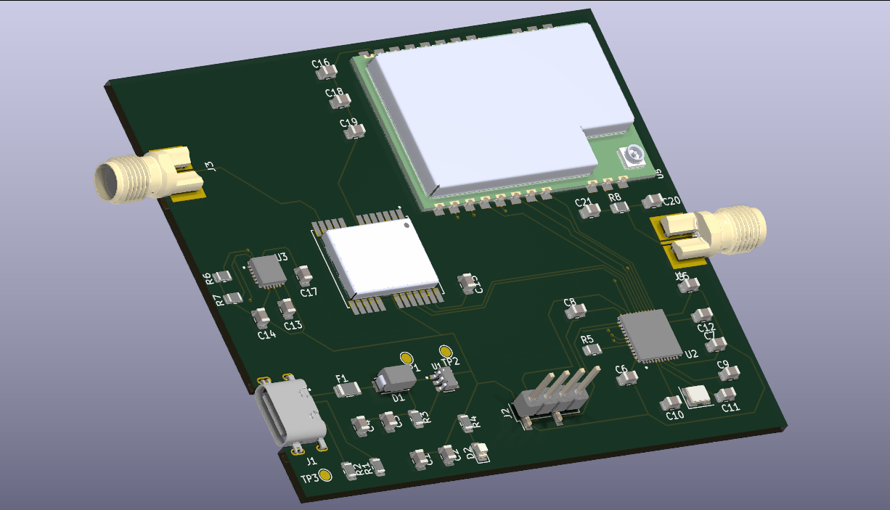
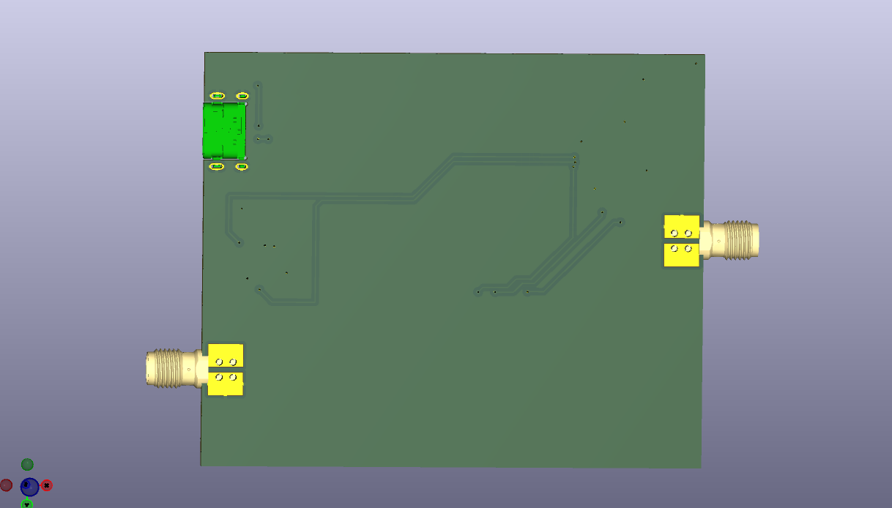

# STM32 LoRa & GPS Telemetry Board (GoraMi)

This project is an STM32-based hardware design that combines long-range RF communication (LoRa), precise location tracking (GPS), and motion/orientation sensing (IMU) on a single compact PCB.

It is designed to provide a robust hardware infrastructure for vehicle tracking, rocket/UAV telemetry systems, weather stations, and remote IoT applications.

## PCB Preview

| Top (component side) | Bottom (solder side) |
|:---:|:---:|
|  |  |

## Project Features and Hardware Components

At the heart of the board lies a powerful ARM Cortex-M4 processor, surrounded by industry-standard peripheral modules:

* **Main Processor (MCU):** STM32F411CEU6 (100 MHz, Cortex-M4)
* **Long-Range Communication:** Ebyte E22-400M30S (LoRa, up to 30 dBm / 1 W)
* **Positioning:** u-blox NEO-6M GPS module
* **Motion Sensor (IMU):** MPU-6050 (3-axis accelerometer + gyroscope, I2C)
* **Power Management:** AP2112K-3.3 LDO (5 V USB → regulated 3.3 V)
* **Connections:**
  * USB for power and data
  * Independent SMA antenna connectors (LoRa and GPS)
  * ST-Link programming and debug header

## Development Progress

| Phase | Status | Notes |
|-------|--------|-------|
| Schematic design | Done | Hierarchical sheets: power, MCU, LoRa, sensors/GPS |
| Custom symbols & footprints | Done | `CompLib/` — project-specific library |
| PCB layout (placement & routing) | Done | 2-layer board, RF and power paths routed |
| 3D models & board review | Done | STEP models linked for major ICs and modules |
| Manufacturing outputs | Ready | BOM, pick-and-place, Gerber archive in `production/` |
| Embedded firmware (C/C++) | **Next step** | HAL/CMSIS drivers, LoRa/GPS/IMU bring-up |

A high-resolution schematic PDF is available at [`docs/schematics.pdf`](docs/schematics.pdf).

## Repository Layout

```
├── GoraMi.kicad_pro          # KiCad project entry point
├── GoraMi.kicad_sch          # Root schematic
├── GoraMi.kicad_pcb          # Board layout
├── mcu_core.kicad_sch        # STM32, clock, debug
├── power_management.kicad_sch
├── lora_communication.kicad_sch
├── sensors_and_gps.kicad_sch
├── CompLib/                  # Symbols, footprints, 3D models
├── docs/                     # Schematic PDF, PCB renders
├── production/               # BOM, PnP CSV, Gerber ZIP
├── fp-lib-table
└── sym-lib-table
```

## Tools Used

The hardware design was developed with **[KiCad 10.0.1](https://www.kicad.org/)**.

1. Install [KiCad 10.0.1](https://www.kicad.org/download/).
2. Clone the repository:
   ```bash
   git clone https://github.com/usarrahim/stm32-lora-gps-tracker.git
   cd stm32-lora-gps-tracker
   ```
3. Open `GoraMi.kicad_pro` in KiCad.

## Manufacturing

| File | Description |
|------|-------------|
| `production/GoraMi.csv` | Bill of materials |
| `production/GoraMi-all-pos.csv` | Pick-and-place (centroid) |
| `production/GoraMi-production.zip` | Gerber, drill, and job files for fab |

## Roadmap

- [x] Design the electrical schematic
- [x] Import custom symbols and footprints
- [x] Optimize PCB component placement
- [x] Route signal and power traces
- [x] Generate manufacturing files (Gerber / BOM / Pick & Place)
- [ ] Write embedded C/C++ firmware (STM32 HAL, LoRa, GPS NMEA, MPU-6050 I2C)

## License

This project is licensed under the MIT License. See [LICENSE](LICENSE) for details.
